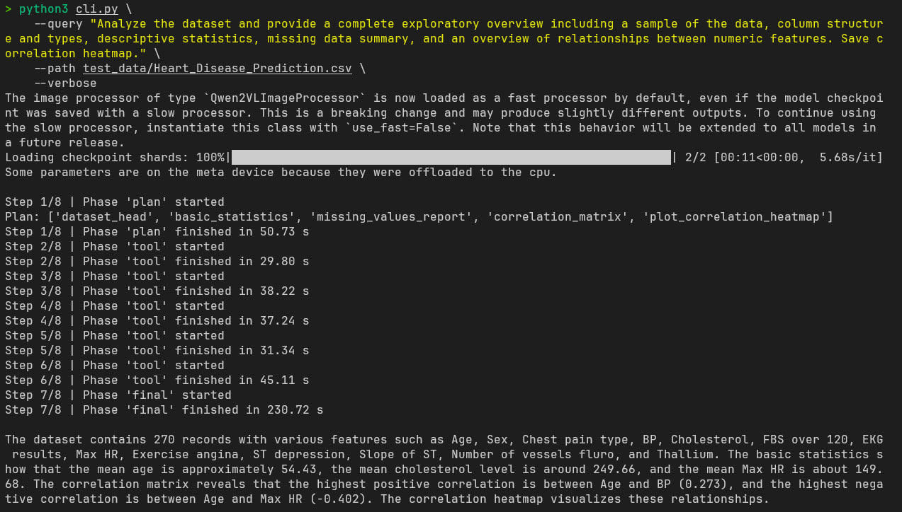
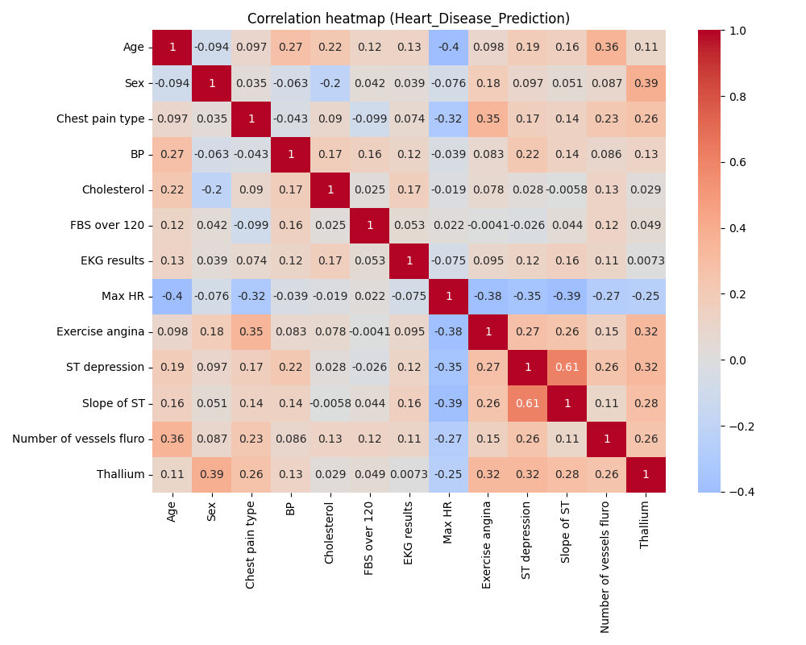

# LLM Data Analyst Agent
A lightweight LLM-powered data analysis agent that performs simple exploratory data analysis \
on tabular datasets using a strict multi-phase protocol and tool-based execution. \
\
This project was built as a pet project to explore:
- tool calling
- deterministic multi-phase workflows
- robust prompt + execution control

## Key Features
- Multi-phase agent architecture:
    - `plan` -> `tool` -> `final`
- Strict tool execution:
    - One tool per step
    - Order enforced by the plan
- JSON-only LLM communication

## Supported Analysis Tools
The agent currently supports the following tools from `llm/tools/tools.py`:
- `load_data`: Load CSV/Parquet dataset
- `dataset_head`: Preview first N rows
- `dataset_info`: Column types and non-null counts
- `basic_statistics`: Mean, median, std, quartiles for numeric columns
- `missing_values_report`: Count and percentage of missing values
- `correlation_matrix`: Correlation for numeric features
- `plot_correlation_heatmap`: Save correlation heatmap as image
All results used in the final answer come from tool outputs.

## Model
You can change the model in `agent.py`:
    ```
    engine = LLMEngine("model")
    ```

## Manual Installation
1. Clone the repository
    ```
    git clone https://github.com/your-username/llm-data-analyst-agent.git
    cd llm-data-analyst-agent
    ```

2. Create and activate a virtual environment
    ```
    python3 -m venv .venv
    source .venv/bin/activate
    ```

3. Upgrade pip
    ```
    pip install --upgrade pip
    ```

4. Install dependencies
    ```
    pip install -r requirements.txt
    ```
    ```md
    This project uses torch and transformers.
    If you want CPU-only installation, install PyTorch manually from:
    https://pytorch.org/get-started/locally/
    ```

## Basic usage
    ```
    python cli.py \
        --query "Analyze the dataset and provide a concise exploratory summary." \
        --path /path/to/dataset.csv \
    ```
### Arguments:
- `--query`: (string) **(required)** Natural language analysis request for the agent
- `--path`: (string) **(required)** Path to the dataset (CSV or Parquet)
- `--verbose`: (flag) Enable verbose logging for debugging
- `--max-steps`: (int) Maximum number of agent execution steps
- `--max-new-tokens-plan`: (int) Token limit for the planning phase
- `--max-new-tokens-tool`: (int) Token limit for tool execution responses
- `--max-new-tokens-final`: (int) Token limit for the final summary

## Example of usage
Tested with `Qwen2.5-VL-3B-Instruct` *(I had better results with VL version. Its good for JSONs)* \
on RTX 3050 mobile 4 GB vram. \
When GPU memory was not enough, the agent automatically fell back to CPU - AMD Ryzen 5 5600H. \

Correlation heatmap saved in `polots/` directory.


